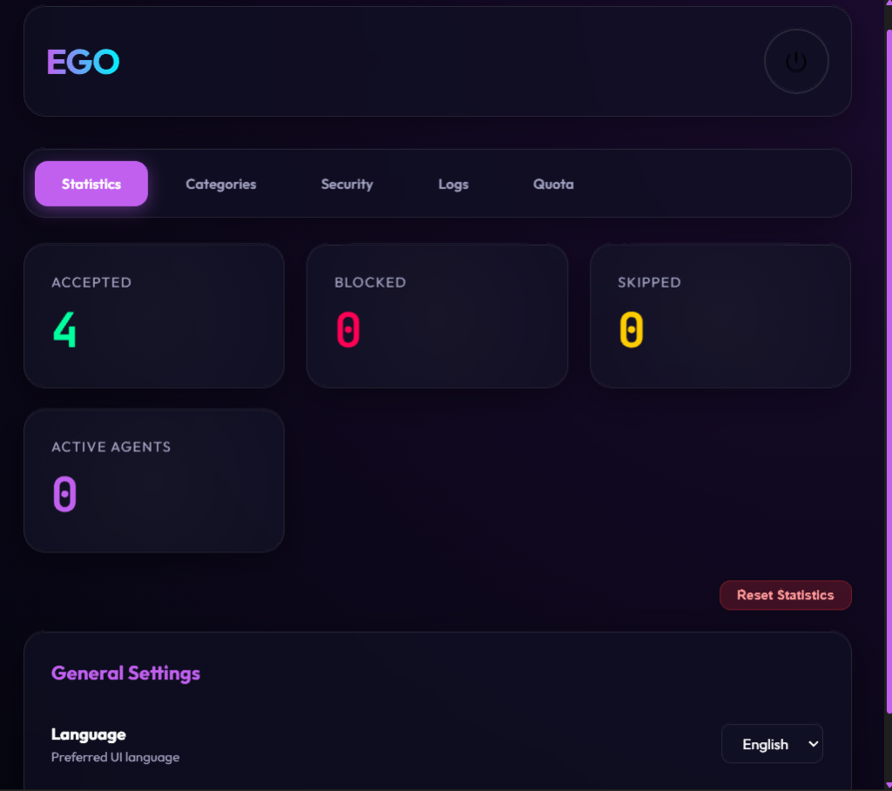
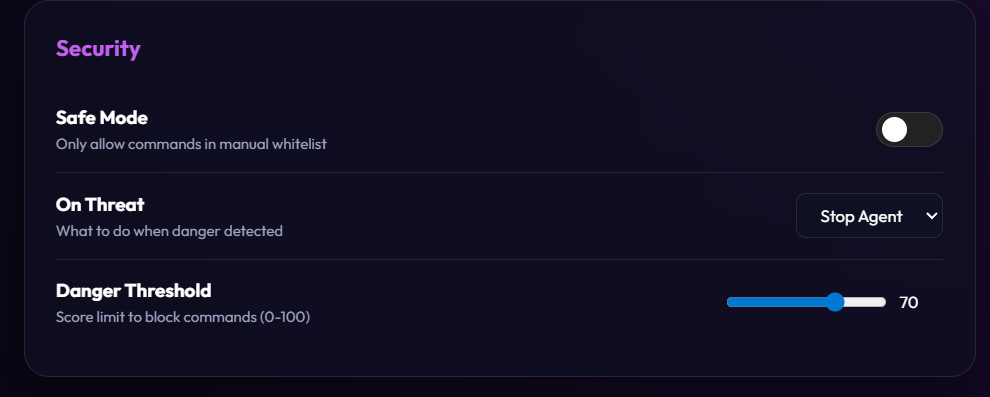
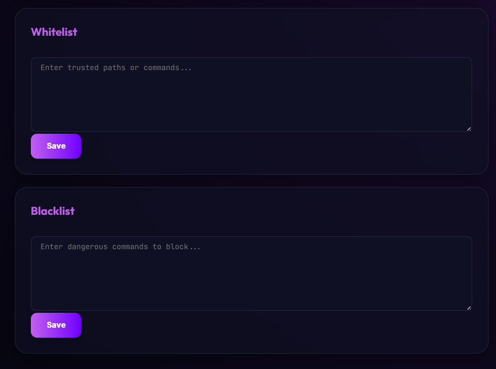
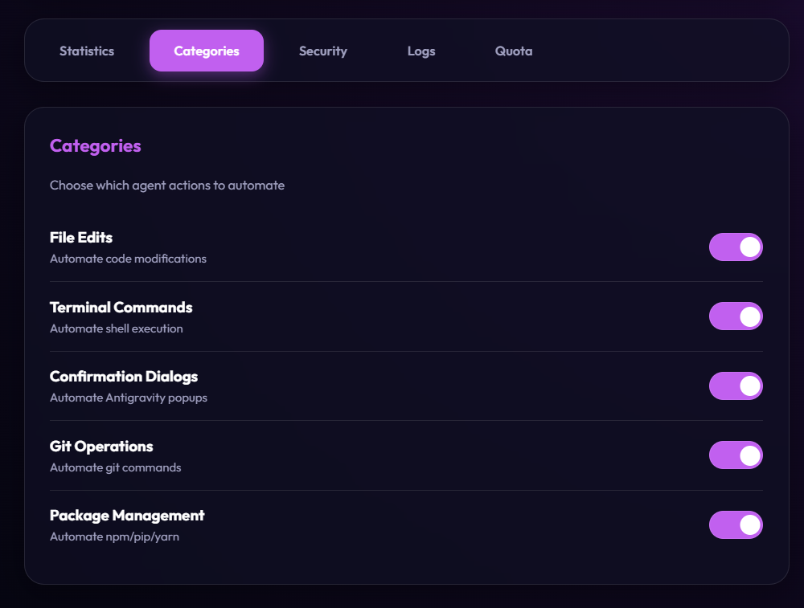
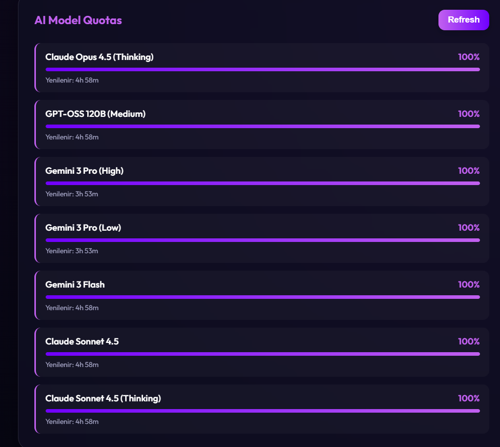

# Auto Accept Ego 🛡️

**The professional auto-acceptance engine for Antigravity AI agents.**

Stop babysitting your AI. **Auto Accept Ego** handles approval dialogs, terminal commands, and file edits automatically while keeping your system safe with a custom 3-level security engine.

---

## ✨ Features

### 🛡️ 3-Level Security
Static blacklist, heuristic pattern detection, and workspace path protection.

### ⚡ Selective Approval
Fine-tune automation for file edits, terminal tasks, and Git operations.

### 📊 AI Quota Tracking
Real-time monitoring of your AI model limits.
- Supports Claude, Gemini, and GPT models
- Visual progress bars with percentage display

### 🎛️ Dashboard
A clean UI to track stats, manage settings, and reset statistics.
- **🌍 Multi-Language:** Built-in support for English and Turkish with instant switching.

**Made by stirner606**
